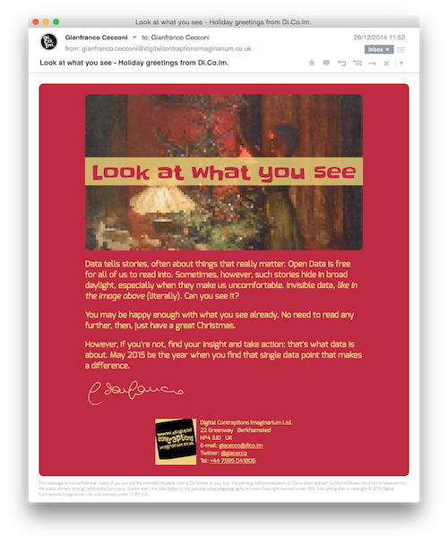

look-at-what-you-see
====================

... so you are **not** happy of what you see! Well done, and welcome to where the secret is unveiled. 

This is how Digital Contraptions Imaginarium's 2014 digital Christmas card looked like:

... and this is the actual image at the top: the one you should start from if you wanted to solve the riddle for yourself:

(there's a [portrait version, too](http://digital-contraptions-imaginarium.github.io/what-do-you-see/Decoration_du_sapin_de_Noel_portrait_wdys.png) I used for displaying on smartphones, if you prefer)

Yes, there *is* data hidden in the painting. I've concealed it using a technique called *steganography*: "the art or practice of concealing a message, image, or file within another message, image, or file" (see the [steganography Wikipedia page](http://en.wikipedia.org/wiki/Steganography)).

The images are produced using [OpenStego](http://www.openstego.info/)'s implementation of the 'random LSB' algorithm. Random LSB hides data by altering the smooth characteristics between adjoining pixels of the source image.

You will find in this repository:
- [the original image I got from Wikipedia](Decoration_du_sapin_de_Noel_original.jpg)
- the edited [landscape](Decoration_du_sapin_de_Noel_landscape.pxm) and [portrait](Decoration_du_sapin_de_Noel_portrait.pxm) versions of the same, cropped and pixelated using [Pixelmator](http://www.pixelmator.com/),
- [the folder containing the data hidden in the pictures](source-data) (but don't cheat! try reverse the steganography first)
- the [script](embed.sh) that hides the data in the final images ([landscape](http://digital-contraptions-imaginarium.github.io/what-do-you-see/Decoration_du_sapin_de_Noel_landscape_wdys.png) and [portrait](http://digital-contraptions-imaginarium.github.io/what-do-you-see/Decoration_du_sapin_de_Noel_portrait_wdys.png)), and 
- the [script](test.sh) I used to check that the steganography was working for real!

On a recent MacOS you should be able to run the scripts without installing anything but Java, that is required by OpenStego.

## Acknowledgments 
I never had the opportunity to write a 'responsive' HTML email. I've used the great guide published by [Campaign Monitor](https://www.campaignmonitor.com/guides/mobile/) as my reference.

OH Paola was instrumental in the finalisation of the text.

## Licence
The picture "Young woman decorates the Christmas tree" by Marcel Rieder is available in the public domain [through Wikipedia](http://en.wikipedia.org/wiki/Christmas_tree#mediaviewer/File:D%C3%A9coration_du_sapin_de_No%C3%ABl.jpg), downloaded on 9 December 2014.

The OpenStego Java libraries re-distributed in this repository are licensed under [GNU GPL v2.0](openstego-0.6.1/LICENSE). 

All datasets are Crown Copyright, published under the terms of the [Open Government Licence v3](http://www.nationalarchives.gov.uk/doc/open-government-licence/version/3/).

Everything else is (c) Digital Contraptions Imaginarium. Code is open source under the MIT license. See the [LICENSE.md](LICENSE.md) file for full details. Non-code is [CC-BY 4.0](https://creativecommons.org/licenses/by/4.0/).
